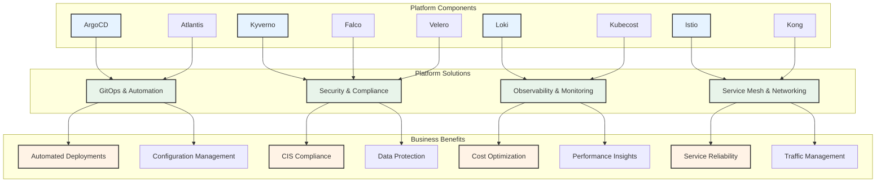
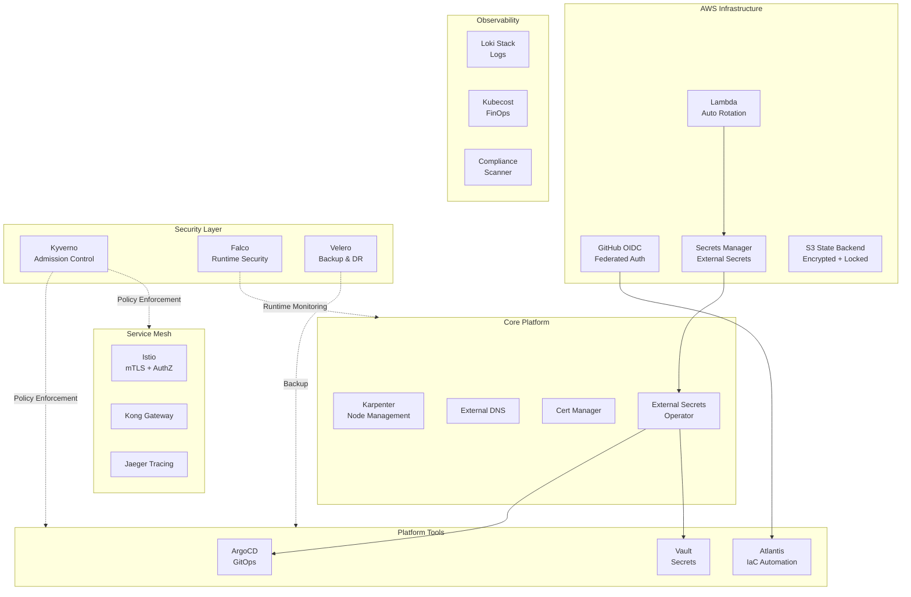

# KubeLaunch Essentials - Enterprise Kubernetes Platform with Security Hardening

A comprehensive, production-ready Kubernetes platform infrastructure with integrated security controls, deployed entirely via Infrastructure as Code (Terraform/Terragrunt).

## 🎯 Platform Overview

KubeLaunch Essentials provides a complete, security-hardened Kubernetes platform with:

- **GitOps & CI/CD Automation** (ArgoCD, Atlantis, OIDC-based workflows)
- **Runtime Security** (Kyverno policy enforcement, Falco threat detection)
- **Operational Security** (Automated secrets rotation, compliance scanning, security monitoring)
- **Service Mesh & Observability** (Istio, Loki, Kubecost)
- **Disaster Recovery** (Velero automated backups)



## 🏗️ Architecture Overview



## 📁 Repository Structure

```
.
├── aws-infrastructure/             # AWS Infrastructure (Terraform)
│   ├── state-backend/              # S3 + DynamoDB state backend security
│   ├── github-oidc/                # GitHub Actions OIDC federation
│   ├── external-secrets-iam/       # IAM roles for External Secrets
│   ├── secrets-rotation-lambda/    # Automated secrets rotation
│   └── security-audit-automation/  # Security monitoring & alerting
│
├── k8s-platform-tools/             # Kubernetes Platform (Terragrunt)
│   ├── core-platform/
│   │   ├── cert-manager/           # Certificate management
│   │   ├── external-dns/           # DNS automation
│   │   ├── external-secrets/       # Secrets management
│   │   └── karpenter/              # Node provisioning
│   ├── service-mesh/
│   │   ├── istio/                  # Service mesh with mTLS
│   │   ├── jeager/                 # Distributed tracing
│   │   └── kong-gw/                # API gateway
│   ├── observability/
│   │   ├── kubecost/               # Cost monitoring
│   │   ├── loki-stack/             # Log aggregation
│   │   └── compliance-scanner/     # CIS benchmark scanning
│   ├── platform-tools/
│   │   ├── airflow/                # Workflow automation
│   │   ├── argocd/                 # GitOps deployment
│   │   ├── atlantis/               # Terraform automation
│   │   └── vault/                  # Secrets management
│   ├── security/
│   │   ├── kyverno/                # Admission controller & policies
│   │   ├── falco/                  # Runtime security monitoring
│   │   └── velero/                 # Backup & disaster recovery
│   ├── common.hcl                  # Shared Terragrunt configuration
│   └── platform_vars.yaml          # Centralized platform configuration
│
├── .github/workflows/
│   └── terragrunt-plan-apply-oidc.yaml  # OIDC-based CI/CD workflow

```

## 🔒 Security Hardening (3-Phase Approach)

All security implementations follow Infrastructure as Code best practices.

### Phase 1: Foundation Security 

**Objective:** Eliminate credential exposure and secure CI/CD

| Component | Description | Status |
|-----------|-------------|--------|
| State Backend Security | S3 encryption, versioning, DynamoDB locking, KMS | ✅ Implemented |
| GitHub OIDC Federation | No long-lived AWS credentials in CI/CD | ✅ Implemented |
| External Secrets IAM | IRSA for secrets access with least privilege | ✅ Implemented |
| Dynamic Account IDs | No hardcoded AWS account IDs | ✅ Implemented |

**Deployment:**

```bash
# Deploy in order
cd aws-infrastructure/state-backend && terragrunt apply
cd aws-infrastructure/github-oidc && terragrunt apply
cd aws-infrastructure/external-secrets-iam && terragrunt apply
```

### Runtime Security 

**Objective:** Implement runtime protection and backup strategy

| Component | Description | Status |
|-----------|-------------|--------|
| Kyverno | Admission controller with 4 policy types | ✅ Implemented |
| Falco | Runtime threat detection with eBPF | ✅ Implemented |
| Velero | Automated backups (daily/hourly/weekly) | ✅ Implemented |
| Network Policies | Default-deny with explicit allow rules | ✅ Implemented |
| Pod Security Standards | Restricted/Baseline/Privileged tiers | ✅ Implemented |

**Policies Enforced:**

- ✅ Approved container registries only (ECR, ghcr.io, quay.io)
- ✅ No 'latest' image tags
- ✅ Required resource limits
- ✅ Security contexts (runAsNonRoot, drop ALL capabilities)

**Deployment:**

```bash
cd k8s-platform-tools/security/kyverno && terragrunt apply
cd k8s-platform-tools/security/falco && terragrunt apply
cd k8s-platform-tools/security/velero && terragrunt apply
```

### Operational Security 

**Objective:** Continuous monitoring, compliance, and automation

| Component | Description | Status |
|-----------|-------------|--------|
| Security Audit Automation | CloudWatch monitoring + alerts | ✅ Implemented |
| Secrets Rotation | Monthly automated rotation via Lambda | ✅ Implemented |
| Compliance Scanner | Weekly CIS benchmark scans | ✅ Implemented |
| Security Dashboard | Centralized security metrics | ✅ Implemented |

**Automated Monitoring:**

- Failed authentication attempts → Alert after 10 in 5 minutes
- Privilege escalation attempts → Immediate alert on CRITICAL events
- Policy violations → Alert after 50 violations/hour
- Secrets rotation failures → Email + Slack notifications

**Deployment:**

```bash
cd aws-infrastructure/security-audit-automation && terragrunt apply
cd aws-infrastructure/secrets-rotation-lambda && terragrunt apply
cd k8s-platform-tools/observability/compliance-scanner && terragrunt apply
```

## 🚀 Quick Start

### Prerequisites

- **Tools:**
  - Terragrunt >= v0.78.0
  - Terraform >= v1.5.0
  - AWS CLI configured
  - kubectl configured
  - Helm v3.x

- **AWS Resources:**
  - EKS cluster
  - VPC with private subnets
  - Route53 hosted zone (optional)

### Initial Setup

1. **Configure Platform Variables**

   ```bash
   cd k8s-platform-tools
   cp platform_vars.yaml.example platform_vars.yaml
   # Edit platform_vars.yaml with your values
   ```

2. **Deploy Foundation Security**

   ```bash
   # Secure state backend
   cd ../aws-infrastructure/state-backend
   terraform init && terraform apply

   # GitHub OIDC for CI/CD
   cd ../github-oidc
   terragrunt apply

   # External Secrets IAM
   cd ../external-secrets-iam
   terragrunt apply
   ```

3. **Deploy Core Platform**

   ```bash
   cd ../../k8s-platform-tools/core-platform
   terragrunt run-all apply
   ```

4. **Deploy Security Layer**

   ```bash
   cd ../security
   terragrunt run-all apply
   ```

5. **Deploy Observability & Tools**

   ```bash
   cd ../observability && terragrunt run-all apply
   cd ../platform-tools && terragrunt run-all apply
   cd ../service-mesh && terragrunt run-all apply
   ```

6. **Deploy Operational Security**

   ```bash
   cd ../../aws-infrastructure/security-audit-automation && terragrunt apply
   cd ../secrets-rotation-lambda && terragrunt apply
   cd ../../k8s-platform-tools/observability/compliance-scanner && terragrunt apply
   ```

## 🔑 Configuration

### Centralized Configuration (`platform_vars.yaml`)

All platform components are configured via a single YAML file:

```yaml
common:
  provider: "aws"
  aws_region: "us-east-2"
  eks_cluster_name: "dev-eks-cluster"
  environment: "dev"
  domain: "cloudon.work"
  common_tags:
    Environment: "dev"
    ManagedBy: "Terragrunt"

Platform:
  Tools:
    argocd:
      inputs:
        argocd_version: "2.1.2"
        # ... configuration

  Security:
    kyverno:
      inputs:
        policies:
          require_approved_registries:
            enabled: true
            approved_registries:
              - "*.dkr.ecr.*.amazonaws.com/*"
              - "ghcr.io/*"

  Observability:
    compliance-scanner:
      inputs:
        scan_schedule: "0 3 * * 1"  # Weekly
        benchmark_version: "cis-1.8"
```

### Environment-Specific Overrides

Use Terragrunt to manage multiple environments:

```bash
# Development
ENV=dev terragrunt apply

# Production
ENV=prod terragrunt apply
```

## 📊 Monitoring & Observability

### Security Dashboard

Access the CloudWatch security dashboard:

```bash
# Get dashboard URL
cd aws-infrastructure/security-audit-automation
terragrunt output dashboard_url
```

**Metrics Tracked:**

- Failed authentication attempts
- Privilege escalation attempts
- Policy violations
- Falco alerts (WARNING, CRITICAL)
- Kyverno policy blocks

### Compliance Reporting

Weekly CIS benchmark reports stored in S3:

```bash
aws s3 ls s3://cloudon-dev-compliance-reports/
```

**Report Contents:**

- CIS Kubernetes Benchmark results
- Pass/fail status for each check
- Remediation recommendations
- Compliance score trends

### Cost Monitoring

Kubecost provides FinOps insights:

- Per-namespace cost allocation
- Resource efficiency recommendations
- Cost anomaly detection
- Budget alerts

## 🔧 CI/CD Integration

### GitHub Actions with OIDC

No long-lived AWS credentials required:

```yaml
permissions:
  id-token: write  # Required for OIDC
  contents: read

jobs:
  deploy:
    runs-on: ubuntu-latest
    steps:
      - uses: aws-actions/configure-aws-credentials@v4
        with:
          role-to-assume: ${{ vars.AWS_ROLE_ARN }}
          role-session-name: GitHubActions-${{ github.run_id }}
          aws-region: us-east-2

      - name: Deploy Infrastructure
        run: terragrunt run-all apply --terragrunt-non-interactive
```

### Automated Security Scanning

Pre-deployment checks:

- Kyverno policy validation
- Container image vulnerability scanning
- Terraform security scanning (tfsec)
- Secret detection (git-secrets)

## 🔄 Operational Procedures

### Daily Operations

**Security Team:**

- Review CloudWatch security dashboard
- Investigate overnight alerts
- Monitor Falco detections

**Platform Team:**

- Monitor cluster health
- Review cost trends in Kubecost
- Check backup status

### Weekly Operations

- Review compliance scan results
- Analyze policy violation trends
- Update security runbooks
- Team security sync

### Monthly Operations

- Secrets rotation (automated)
- Review IAM permissions
- Update security policies
- Disaster recovery drill

## 📈 Version Matrix

| Component | Version | Helm Chart | Status |
|-----------|---------|------------|--------|
| **Core Platform** | | | |
| Karpenter | v0.32.x | 0.32.x | ✅ |
| External Secrets | v0.9.9 | 0.9.9 | ✅ |
| Cert Manager | v1.13.x | 1.13.x | ✅ |
| **Security** | | | |
| Kyverno | v3.1.0 | 3.1.0 | ✅ |
| Falco | v4.0.0 | 4.0.0 | ✅ |
| Velero | v5.1.0 | 5.1.0 | ✅ |
| **Service Mesh** | | | |
| Istio | v1.19.x | 1.19.x | ✅ |
| Kong | v3.5.x | 2.25.x | ✅ |
| **Tools** | | | |
| ArgoCD | v2.7.x | 5.46.x | ✅ |
| Vault | v1.15.x | 0.25.x | ✅ |

## 🐛 Troubleshooting

### Common Issues

**1. State Lock Conflicts**

```bash
terragrunt force-unlock <LOCK_ID>
```

**2. OIDC Authentication Failures**

```bash
# Verify GitHub OIDC provider
aws iam list-open-id-connect-providers

# Check role trust policy
aws iam get-role --role-name github-actions-terraform
```

**3. Policy Violations Blocking Deployments**

```bash
# Temporarily set to Audit mode
kubectl patch clusterpolicy require-approved-registries \
  -p '{"spec":{"validationFailureAction":"Audit"}}'

# Review violations
kubectl get policyreport -A
```

**4. Secrets Not Syncing**

```bash
# Check External Secret status
kubectl describe externalsecret <name> -n <namespace>

# Force sync
kubectl annotate externalsecret <name> \
  force-sync=$(date +%s) -n <namespace>
```

### Debug Commands

```bash
# Check all pods status
kubectl get pods -A --field-selector=status.phase!=Running

# View Falco alerts
kubectl logs -n falco -l app.kubernetes.io/name=falco | grep CRITICAL

# Check Kyverno policy reports
kubectl get clusterpolicyreport -o yaml

# View Velero backups
velero backup get
velero backup describe <backup-name>
```

## 📊 Cost Optimization

### Estimated Monthly Costs (dev environment)

| Component | Monthly Cost | Notes |
|-----------|-------------|-------|
| **AWS Infrastructure** | | |
| S3 State Backend | $1-2 | Minimal storage |
| DynamoDB State Lock | $0.25 | PAY_PER_REQUEST |
| CloudWatch Logs | $15 | 90-day retention |
| Secrets Manager | $5 | ~10 secrets |
| Lambda Functions | $0.51 | Minimal invocations |
| **Kubernetes** | | |
| EKS Cluster | $73 | Control plane |
| Worker Nodes (3x t3.medium) | $100 | Spot instances recommended |
| **Total** | **~$195/month** | Dev environment |

### Cost Reduction Tips

1. Use Spot instances for non-critical workloads
2. Enable Karpenter consolidation
3. Reduce log retention to 30 days
4. Use S3 Intelligent-Tiering for backups
5. Monitor with Kubecost recommendations

## 🔐 Security Best Practices

✅ **Implemented in this platform:**

- No hardcoded credentials anywhere
- OIDC federation for CI/CD (no long-lived keys)
- Least-privilege IAM policies
- State encryption at rest (KMS)
- State locking (DynamoDB)
- Secrets managed via External Secrets Operator
- Pod Security Standards enforced
- Network policies (default-deny)
- Runtime threat detection (Falco)
- Admission control (Kyverno)
- Automated backups (Velero)
- Automated secrets rotation
- Continuous compliance scanning
- Security event monitoring & alerting

## 📝 Documentation

- [Security Review](./SECURITY_REVIEW.md) - Initial security audit findings
- [Security Implementation Plan](./SECURITY_IMPLEMENTATION_PLAN.md) - Complete security roadmap
- [Phase 1 Deployment Guide](./PHASE1_FOUNDATION_SECURITY_DEPLOYMENT.md) - Foundation security
- [Phase 2 Deployment Guide](./PHASE2_SECURITY_DEPLOYMENT.md) - Runtime security
- [Phase 3 Deployment Guide](./PHASE3_OPERATIONAL_SECURITY_DEPLOYMENT.md) - Operational security
- [IaC Summary](./INFRASTRUCTURE_AS_CODE_SUMMARY.md) - Complete IaC overview

## 🤝 Contributing

1. Fork the repository
2. Create your feature branch (`git checkout -b feature/amazing-feature`)
3. Commit your changes (`git commit -m 'Add amazing feature'`)
4. Push to the branch (`git push origin feature/amazing-feature`)
5. Open a Pull Request

**Contribution Guidelines:**

- All infrastructure must be defined as code (no manual changes)
- Follow existing Terragrunt/Terraform patterns
- Update `platform_vars.yaml` for configuration
- Add tests for new security policies
- Update relevant documentation

## 📄 License

This project is licensed under the MIT License - see the [LICENSE](LICENSE) file for details.

## 🤝 Support

For support:

- Open an issue in the repository
- Check existing documentation
- Review troubleshooting section
- Contact: platform-team@cloudon-one.com

## 🎯 Roadmap

- [ ] Multi-cluster federation
- [ ] Advanced cost optimization automation
- [ ] Automated incident response workflows
- [ ] Integration with SIEM platforms
- [ ] Chaos engineering framework
- [ ] Advanced observability (OpenTelemetry)

---

**Built with ❤️ for production Kubernetes deployments**
