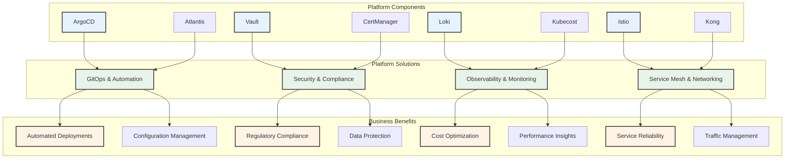
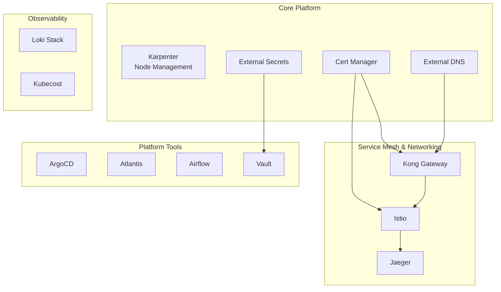

# KubeLaunch - Comprehensive Kubernetes Platform Infrastructure

This repository contains both Terragrunt configurations and Terraform modules for deploying and managing a comprehensive Kubernetes platform with essential services and tools.

## 🎯 Solutions Overview



## 🏗️ Architecture Overview



## 📁 Repository Structure

```
.
├── core-platform/           # Core platform components
│   ├── cert-manager         # Certificate management
│   ├── external-dns         # DNS automation
│   ├── external-secrets     # Secrets management
│   └── karpenter           # Kubernetes node provisioning
├── service-mesh/            # Service mesh components
│   ├── istio               # Service mesh control plane
│   ├── jeager              # Distributed tracing
│   └── kong-gw             # API gateway
├── observability/          # Monitoring and observability
│   ├── kubecost            # Cost monitoring
│   └── loki-stack          # Log aggregation
├── platform-tools/         # Platform utilities
│   ├── airflow             # Workflow automation
│   ├── argocd              # GitOps deployment
│   ├── atlantis            # Terraform automation
│   └── vault               # Secrets management
└── ci-cd-templates/        # Reusable CI/CD workflows
```

## 🚀 Prerequisites

- Terragrunt >= v0.60.0
- Terraform >= v1.5.0
- AWS CLI configured
- kubectl configured
- Helm v3.x

## 🔑 Configuration

### Common Configuration (common.hcl)
```hcl
locals {
  platform_vars     = yamldecode(file(("platform_vars.yaml")))
  eks_cluster_name  = local.platform_vars.common.eks_cluster_name
  environment       = get_env("ENV", "dev")
  aws_region        = local.platform_vars.common.aws_region
  tags              = local.platform_vars.common.common_tags 
}
```

### Platform Variables example (platform_vars.yaml)
```yaml
aws_region:       "us-east-2"
eks_cluster_name: "dev-eks-cluster"
environment:      "dev"
domain_name:      "cloudon.work"
common_tags:
    Environment:  "dev"
    Owner:        "cloudon"
    ManagedBy:    "Terragrunt"
    Team:         "platform"
    ClusterName:  "dev-eks-cluster"
```

## 📦 Component Deployment Order

1. **Core Platform**
   ```bash
   terragrunt run-all apply --terragrunt-working-dir core-platform
   ```

2. **Service Mesh & Networking**
   ```bash
   terragrunt run-all apply --terragrunt-working-dir service-mesh
   ```

3. **Observability**
   ```bash
   terragrunt run-all apply --terragrunt-working-dir observability
   ```

4. **Platform Tools**
   ```bash
   terragrunt run-all apply --terragrunt-working-dir platform-tools
   ```

## 🔧 Module Structure

Each module follows a consistent structure:

```
k8s-platform-<component>/
├── README.md           # Module documentation
├── main.tf            # Main Terraform configuration
├── variables.tf       # Input variables
├── outputs.tf         # Output values
├── versions.tf        # Provider & version constraints
├── examples/          # Example implementations
│   └── main.tf
└── templates/         # Helm values templates
    └── values.yaml
```

## 🔒 Security Considerations

1. **IRSA (IAM Roles for Service Accounts)**
   - Used for AWS service integration
   - Defined per component
   - Least privilege principle

2. **Network Security**
   - Service mesh encryption
   - Network policies
   - Ingress configuration

3. **Secret Management**
   - External Secrets integration
   - Vault for sensitive data
   - SOPS encryption

## 📊 Monitoring & Observability

- Loki for log aggregation
- Jaeger for distributed tracing
- Kubecost for cost monitoring
- Custom dashboards in Grafana

## 🔄 Version Matrix

| Component | Version | Terraform Provider | Helm Chart |
|-----------|---------|-------------------|------------|
| ArgoCD    | v2.7.x  | >= 2.0.0 | 5.46.x |
| Istio     | 1.19.x  | >= 2.0.0 | 1.19.x |
| Vault     | 1.15.x  | >= 2.0.0 | 0.25.x |
| Kong      | 3.5.x   | >= 2.0.0 | 2.25.x |

## 🔧 Maintenance

### Regular Tasks
- Update component versions
- Review resource utilization
- Monitor costs with Kubecost
- Backup critical configurations

### Upgrades
```bash
# Update single component
cd component-name
terragrunt apply

# Update all components
terragrunt run-all apply
```

### Backup
```bash
# Backup state
terragrunt state pull > backup.tfstate
```

## 🐛 Troubleshooting

Common issues and solutions:

1. **State Lock Issues**
   ```bash
   terragrunt force-unlock <LOCK_ID>
   ```

2. **Dependency Errors**
   - Check `dependencies` blocks
   - Verify component order
   - Check for circular dependencies

3. **AWS Authentication**
   - Verify AWS credentials
   - Check IAM roles
   - Validate IRSA configuration

## 📝 Contributing

1. Fork the repository
2. Create your feature branch
3. Commit your changes
4. Push to the branch
5. Create a Pull Request

## 📄 License

This project is licensed under the MIT License - see the [LICENSE](LICENSE) file for details.

## 🤝 Support

For support, please open an issue in the repository.