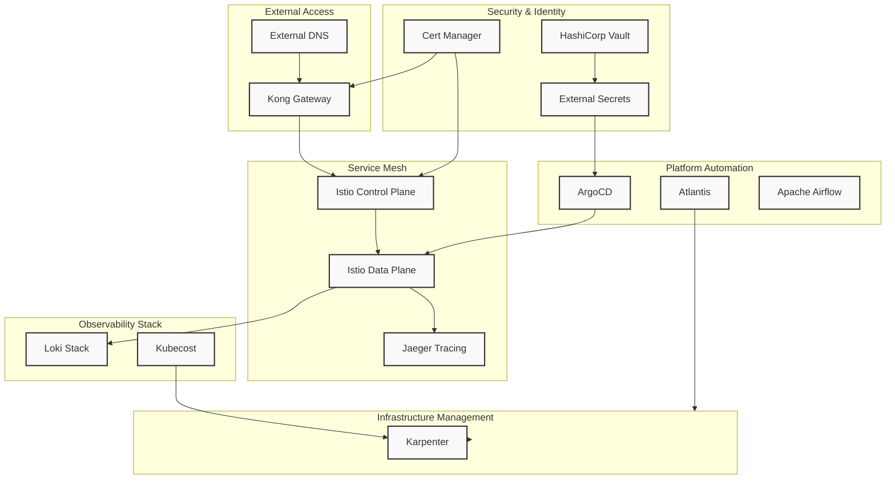
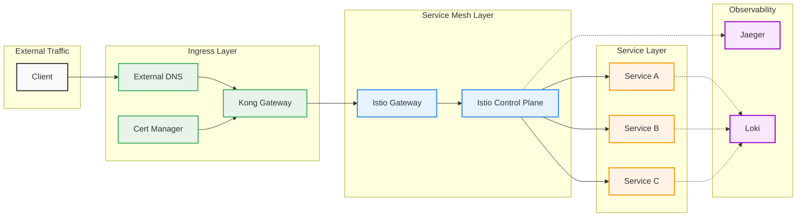
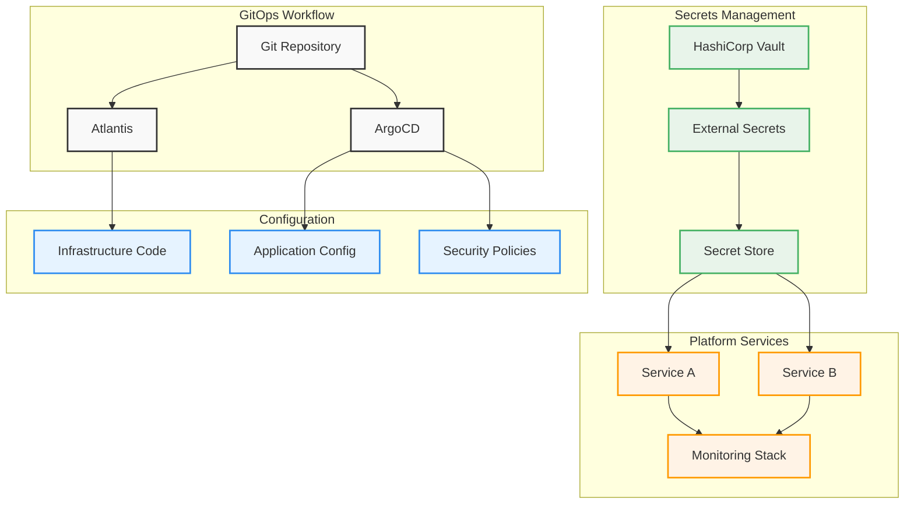
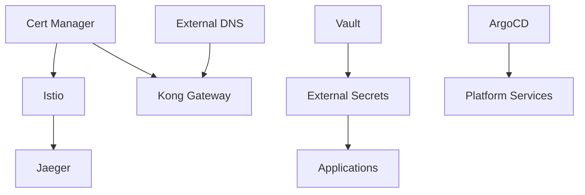

# Kubernetes Platform Terraform Modules

A collection of Terraform modules for deploying and managing a comprehensive Kubernetes platform with essential services and tools.

## 🚀 Platform Components


### Core Infrastructure
- **[Karpenter](./k8s-platform-karpenter)**: Kubernetes Node Autoscaling
- **[External DNS](./k8s-platfrom-external-dns)**: DNS Records Management
- **[Cert Manager](./k8s-platform-cert-manager)**: Certificate Management
- **[External Secrets](./k8s-platform-external-secrets)**: Secrets Management

### Service Mesh & Networking
- **[Istio](./k8s-platform-istio)**: Service Mesh
- **[Kong Gateway](./k8s-platform-kong-gw)**: API Gateway
- **[Jaeger](./k8s-platform-jeager)**: Distributed Tracing
- **vault**: Secrets management

### Observability & Monitoring
- **[Loki Stack](./k8s-platform-loki-stack)**: Log Aggregation
- **[Kubecost](./k8s-platform-kubecost)**: Cost Management
- **[ArgoCD](./k8s-platform-argocd)**: GitOps & Deployment Management

### Platform Tools
- **[Airflow](./k8s-platform-airflow)**: Workflow Management
- **[Atlantis](./k8s-platform-atlantis)**: Terraform Automation
- **[Vault](./k8s-platform-vault)**: Secrets Management

## 📋 Prerequisites

- Terraform >= 1.5.0
- Kubernetes cluster (tested with EKS)
- kubectl configured to access your cluster
- Helm 3.x
- AWS CLI configured (if using AWS services)

## 🏗️ Architecture

### Platform Components


This diagram shows the high-level architecture of the platform, including:
- External access layer (Kong, External DNS)
- Security components (Cert Manager, Vault)
- Service mesh (Istio, Jaeger)
- Observability stack (Loki, Kubecost)
- Automation tools (ArgoCD, Atlantis, Airflow)
- Infrastructure management (Karpenter)

### Network Flow


This diagram illustrates:
- External traffic flow
- Ingress configuration
- Service mesh routing
- Observability integration

### Configuration Management

This diagram shows:
- GitOps workflows
- Secrets management
- Configuration distribution
- Service integration

## 🛠️ Module Structure

Each module follows a consistent structure:

```
k8s-platform-<component>/
├── README.md           # Module documentation
├── main.tf             # Main Terraform configuration
├── variables.tf        # Input variables
├── outputs.tf          # Output values
├── versions.tf         # Provider & version constraints
├── examples/           # Example implementations
│   └── main.tf
└── templates/          # Helm values templates
    └── values.yaml
```

## 🚀 Quick Start

1. Clone the repository:
```bash
git clone https://github.com/cloudon-one/k8s-platform-modules.git
```

2. Choose the modules you need and create your configuration:
```hcl
module "cert_manager" {
  source = "./k8s-platform-cert-manager"
  # ... configuration ...
}

module "external_dns" {
  source = "./k8s-platform-external-dns"
  # ... configuration ...
}

# Add more modules as needed
```

## 📦 Available Modules

### Core Infrastructure

#### Karpenter
```hcl
module "karpenter" {
  source = "./k8s-platform-karpenter"
  cluster_name = "my-cluster"
}
```

#### External DNS
```hcl
module "external_dns" {
  source = "./k8s-platfrom-external-dns"
  domain = "example.com"
}
```

### Service Mesh & Networking

#### Istio
```hcl
module "istio" {
  source = "./k8s-platform-istio"
  enable_monitoring = true
}
```

#### Kong Gateway
```hcl
module "kong" {
  source = "./k8s-platform-kong-gw"
  enable_proxy_protocol = true
}
```

### Observability & Monitoring

#### Loki Stack
```hcl
module "loki" {
  source = "./k8s-platform-loki-stack"
  retention_days = 30
}
```

## 🔧 Configuration

Each module has its own configuration options. Please refer to the individual module's README.md for detailed configuration options.

## 🔍 Module Dependencies



## 🛡️ Security Features

- HTTPS enabled by default
- RBAC configurations included
- Network policies defined
- Security context constraints
- Service mesh security

## 📊 Monitoring & Observability

- Prometheus metrics exposed
- Grafana dashboards included
- Tracing with Jaeger
- Logging with Loki
- Cost monitoring with Kubecost

## 🤝 Contributing

1. Fork the repository
2. Create your feature branch
3. Commit your changes
4. Create a pull request

## Security

- All secrets are managed through external-secrets
- TLS certificates are managed by cert-manager
- Network policies are enforced through Istio
- Regular security scanning with built-in tools

## Maintenance

### Regular Tasks

- Update component versions
- Review resource utilization
- Monitor costs with Kubecost
- Backup critical configurations

### Version Updates

Update component versions in respective `terragrunt.hcl` files:
```hcl
inputs = {
  chart_version = "x.y.z"
}
```

## Support

For issues and support:
1. Check existing issues
2. Create a new issue with:
   - Environment details
   - Error messages
   - Steps to reproduce

## License

This project is licensed under the MIT License - see the [LICENSE](LICENSE) file for details.


## ✨ Best Practices

1. **Infrastructure as Code**
   - Use GitOps workflows
   - Implement proper state management
   - Version your infrastructure code

2. **Security**
   - Enable RBAC
   - Use network policies
   - Implement secret management
   - Enable service mesh security features

3. **Monitoring**
   - Set up proper alerting
   - Implement logging
   - Enable tracing
   - Monitor costs

4. **Scalability**
   - Use node autoscaling
   - Implement pod autoscaling
   - Configure proper resource requests/limits

## 📚 Documentation

Each module contains its own detailed README with:
- Configuration options
- Example usage
- Common pitfalls
- Troubleshooting guide

## 🤝 Support

For support, please open an issue in the repository.

## 🔄 Version Compatibility Matrix

| Module | Kubernetes Version | Terraform Version | Provider Version |
|--------|-------------------|-------------------|------------------|
| ArgoCD | >=1.24 | >=1.0.0 | >=2.0.0 |
| Istio | >=1.24 | >=1.0.0 | >=2.0.0 |
| Cert Manager | >=1.24 | >=1.0.0 | >=2.0.0 |
| Kong Gateway | >=1.24 | >=1.0.0 | >=2.0.0 |
| External DNS | >=1.24 | >=1.0.0 | >=2.0.0 |
| Vault | >=1.24 | >=1.0.0 | >=2.0.0 |

## 🔄 Upgrade Guide

Please refer to individual module READMEs for specific upgrade instructions.